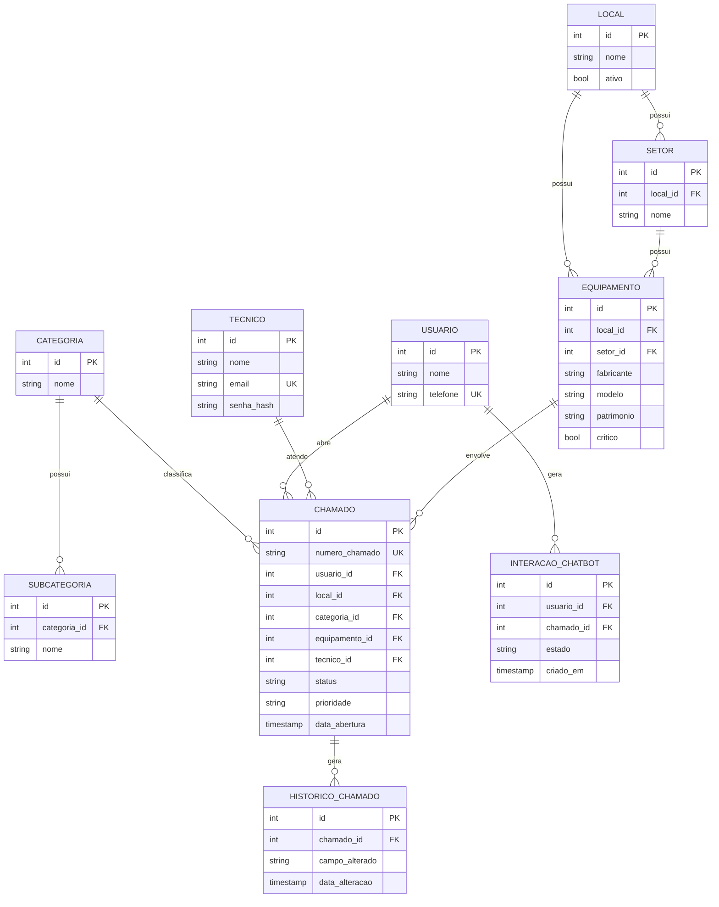

# Chatbot de Abertura e Gerenciamento de Chamados de TI via WhatsApp

**Documentação Inicial do Projeto**
Status: Fases 1, 2 e 3 concluídas (Requisitos, Arquitetura, Modelagem do Banco) · Fase 4 (Backend) em preparação

---

## 1. Visão geral

Sistema de service desk de TI operado via WhatsApp, atendendo colaboradores de três ambientes: **Clínica**, **Hospital** e **Escritório**. O colaborador abre o chamado conversando com o chatbot; o técnico gerencia, diagnostica e encerra o chamado via API/painel.

O projeto tem duplo objetivo: (1) ser uma ferramenta funcional para o dia a dia de suporte técnico do autor e (2) servir como projeto de aprendizado estruturado de arquitetura de software, aplicando conhecimento prévio em C#/.NET, Java/Spring, JWT, EF Core e PostgreSQL.

O sistema é desenvolvido em **fases incrementais**, cada uma concluída e compreendida antes de avançar para a seguinte, começando por um **MVP** enxuto e evoluindo para painel administrativo, base de conhecimento e IA.

---

## 2. Requisitos Funcionais (RF)

### Interação via WhatsApp
| # | Requisito |
|---|---|
| RF-01 | Receber mensagens de texto enviadas por colaboradores via WhatsApp |
| RF-02 | Conduzir conversa estruturada (fluxo guiado) para coletar dados do chamado |
| RF-03 | Suportar respostas por número/opção (menu) e texto livre |
| RF-04 | Identificar o usuário pelo telefone; coletar nome/local se for novo |
| RF-05 | Manter o estado da conversa entre mensagens |
| RF-06 | Permitir correção de informações antes da confirmação do chamado |
| RF-07 | Responder com o número do chamado gerado ao final do fluxo |
| RF-08 | Lidar com mensagens fora do fluxo esperado (áudio, emoji, texto aleatório) |

### Gestão de chamados
| # | Requisito |
|---|---|
| RF-09 | Gerar identificador único e sequencial por chamado (ex: `CH-2026-000123`) |
| RF-10 | Armazenar todos os dados do chamado |
| RF-11 | Permitir que o técnico liste chamados filtrando por status/local/categoria/prioridade |
| RF-12 | Permitir que o técnico assuma um chamado |
| RF-13 | Permitir alteração de status ao longo do atendimento |
| RF-14 | Permitir registro de diagnóstico, solução, tempo de atendimento e observações |
| RF-15 | Manter histórico de todas as alterações de um chamado (auditoria) |
| RF-16 | Gerar automaticamente um relatório estruturado ao encerrar o chamado |

### Cadastros de apoio
| # | Requisito |
|---|---|
| RF-17 | Permitir cadastrar/editar locais, setores, categorias, subcategorias e equipamentos sem alterar código-fonte |
| RF-18 | Permitir cadastrar técnicos e seus níveis de acesso |

### Futuro (fora do MVP)
| # | Requisito |
|---|---|
| RF-19 | Base de conhecimento pesquisável |
| RF-20 | IA para classificação/sugestão de chamados |
| RF-21 | Painel com gráficos e indicadores |

---

## 3. Requisitos Não Funcionais (RNF)

| # | Requisito | Justificativa |
|---|---|---|
| RNF-01 | Disponibilidade 24/7 e resposta rápida do webhook | Ambiente hospitalar não tem horário fixo de problemas; Cloud API exige resposta rápida |
| RNF-02 | Segurança: HTTPS, tokens fora do código-fonte, senhas com hash | Padrão mínimo de segurança para credenciais |
| RNF-03 | Minimização de dados (LGPD) | Bot não deve coletar dado clínico de paciente, só dado técnico |
| RNF-04 | Auditabilidade — toda mudança relevante gera histórico | Necessário em ambiente de saúde |
| RNF-05 | Locais/categorias/subcategorias como dados, não código | Permite expansão sem deploy |
| RNF-06 | Usabilidade conversacional — poucas perguntas por vez | Evita abandono do atendimento |
| RNF-07 | Manutenibilidade — separação clara entre motor de conversa e regras de negócio | Permite evoluir um sem quebrar o outro |
| RNF-08 | Observabilidade — logs de erros de integração e de fluxo | Diagnóstico em produção |
| RNF-09 | Portabilidade futura (Docker) | Não é requisito do MVP, mas é desejável mais adiante |

---

## 4. Entidades principais

| Entidade | Papel |
|---|---|
| `Usuario` | Colaborador que abre chamados (identificado pelo WhatsApp) |
| `Tecnico` | Quem atende os chamados (login no painel/API) |
| `Local` | Clínica, Hospital, Escritório (extensível) |
| `Setor` | Subdivisão do local |
| `Categoria` | Rede, Computador, Impressora, Equipamento médico... |
| `Subcategoria` | Detalhamento da categoria |
| `Equipamento` | Ativo físico (fabricante, modelo, patrimônio, crítico ou não) |
| `Chamado` | Entidade central — liga tudo |
| `HistoricoChamado` | Log de alterações de um chamado |
| `InteracaoChatbot` | Registro bruto da conversa |
| `SolucaoConhecimento` | (futuro) base de conhecimento |

---

## 5. Fluxos

### 5.1 Fluxo do chatbot (máquina de estados)

```
INICIO
  → AGUARDANDO_NOME
  → AGUARDANDO_LOCAL
  → AGUARDANDO_CATEGORIA
  → AGUARDANDO_SUBCATEGORIA (se aplicável)
  → AGUARDANDO_DESCRICAO
  → PERGUNTAS_ESPECIFICAS (depende da categoria)
  → AGUARDANDO_IMPACTO_URGENCIA
  → CONFIRMACAO
  → CHAMADO_CRIADO
```

Fluxos alternativos previstos: usuário já conhecido (pula pergunta de nome), correção de resposta antes da confirmação, mensagem fora do esperado (reapresenta pergunta atual), sessão expirando por timeout, cancelamento no meio do fluxo, novo chamado com chamado já em aberto.

### 5.2 Fluxo do técnico

```
LISTA DE CHAMADOS (filtrada)
  → ASSUME CHAMADO (status → Em análise)
  → REGISTRA DIAGNÓSTICO (status → Em atendimento)
  → [opcional] AGUARDANDO USUÁRIO / TERCEIRO
  → REGISTRA SOLUÇÃO
  → ENCERRA (status → Resolvido)
  → [confirmação, se aplicável] → Fechado
```

---

## 6. Regras de negócio

- Um chamado sempre pertence a exatamente um Local, uma Categoria e um Usuário solicitante.
- Um chamado pode ou não estar associado a um Equipamento específico.
- Prioridade sugerida automaticamente por Categoria + Impacto/Urgência, **sempre editável pelo técnico**.
- Chamados envolvendo **equipamento médico crítico** indisponível e afetando atendimento a paciente são sinalizados automaticamente com prioridade mínima **Alta**, independentemente da resposta do usuário — trava de negócio, não apenas técnica.
- O chatbot nunca orienta procedimento técnico em equipamento médico; apenas coleta dados e encaminha ao técnico. O sistema é uma ferramenta de **triagem**, não de diagnóstico médico.
- Status **"Resolvido" ≠ "Fechado"**: resolvido = técnico aplicou a solução; fechado = ciclo formalmente encerrado (política de confirmação a definir na Fase 5, alinhada a conceitos de ITIL/Service Desk).
- Transições de status seguem uma ordem válida (não é permitido pular, por exemplo, de "Aberto" direto para "Fechado").

---

## 7. Segurança

- Autenticação de técnicos via JWT.
- Autorização por papel (técnico comum vs. administrador que cadastra locais/categorias).
- Token da WhatsApp Cloud API armazenado fora do código-fonte (variável de ambiente/secret manager).
- Validação de assinatura do webhook do WhatsApp.
- Log de auditoria de alterações em chamados.
- Minimização de dados pessoais/clínicos — o bot não pergunta CPF de paciente, prontuário ou diagnóstico clínico.
- Rate limiting básico no endpoint de webhook.

---

## 8. Riscos identificados

| Risco | Mitigação |
|---|---|
| Escopo grande demais para dev júnior solo | MVP enxuto, fases incrementais |
| Complexidade de aprovação/configuração da WhatsApp Cloud API | Tratar como possível maior gargalo de tempo, não o backend |
| Modelagem rígida (hardcoded) | Local/Categoria/Setor como dados, não enum fixo (RNF-05) |
| Fluxo de conversa engessado | Validação tolerante e reapresentação de menu em caso de resposta inesperada |
| Exposição regulatória (LGPD) em ambiente de saúde | Mentalidade de minimização de dados desde o dia 1 |

---

## 9. MVP inicial

**Incluído:**
- Fluxo de chatbot completo (identificação → local → categoria → descrição → prioridade → confirmação → geração de chamado).
- Persistência em banco relacional (PostgreSQL).
- API REST para técnico listar, assumir, atualizar status e encerrar chamado.
- Geração de número de chamado sequencial e legível.
- Histórico básico de alterações.
- Regra de prioridade (impacto × urgência) com override do técnico.
- Sinalização automática de equipamento médico crítico.

**Fora do MVP (fases futuras):**
- Painel administrativo com gráficos.
- Base de conhecimento pesquisável.
- IA como assistente do técnico.
- Relatórios exportáveis em PDF/Excel.
- Multi-tenant, múltiplos canais além do WhatsApp.
- Deploy containerizado (Docker).

---

## 10. Arquitetura

### 10.1 Visão em camadas

```
WhatsApp (usuário)
   ↓ mensagem
WhatsApp Cloud API (Meta)
   ↓ webhook (HTTP POST)
Canal (Webhook / Adapter WhatsApp)
   ↓
Motor de Conversa (máquina de estados do chatbot)
   ↓
Domínio / Service Desk Core (regras de negócio)
   ↑
API REST (consumida pelo painel do técnico)
   ↑
Painel Web (fase futura)
   ↓
Banco de Dados (PostgreSQL)
```

**Princípio central:** motor de conversa e regras de negócio são camadas **separadas**. O motor de conversa só sabe conduzir perguntas; ele não conhece regras como "equipamento crítico → prioridade Alta". Essas regras vivem na camada de Domínio, que é acionada tanto pelo chatbot quanto pela futura API REST/painel — **duas entradas, um único lugar de regras**, evitando duplicação de lógica de negócio.

### 10.2 Estrutura de solução (.NET)

```
ServiceDeskBot.sln
 ├─ ServiceDeskBot.Api            → Controllers (Webhook + API REST), Program.cs
 ├─ ServiceDeskBot.ChatEngine     → Máquina de estados da conversa
 ├─ ServiceDeskBot.Domain         → Entidades, regras de negócio, serviços de domínio
 ├─ ServiceDeskBot.Infrastructure → EF Core, DbContext, repositórios, integração WhatsApp
 └─ ServiceDeskBot.Tests          → Testes unitários (principalmente Domain e ChatEngine)
```

Regra de dependência: **Domain não depende de nada** (nem EF Core, nem WhatsApp). Infrastructure e ChatEngine dependem do Domain (Dependency Inversion) — o núcleo de negócio não deve saber como os dados são persistidos nem por qual canal a mensagem chegou.

### 10.3 Desenho preliminar da API REST (detalhamento na Fase 8)

```
GET    /api/chamados                  → lista chamados (filtros via query string)
GET    /api/chamados/{id}             → detalhe de um chamado
POST   /api/chamados/{id}/assumir     → técnico assume o chamado
PATCH  /api/chamados/{id}/status      → altera status
POST   /api/chamados/{id}/diagnostico → registra diagnóstico
POST   /api/chamados/{id}/solucao     → registra solução e encerra
GET    /api/chamados/{id}/historico   → histórico de alterações

GET    /api/locais
GET    /api/categorias
GET    /api/equipamentos

POST   /api/auth/login                → login do técnico (retorna JWT)
```

Ações de domínio (assumir, diagnóstico, solução) são modeladas como endpoints específicos, não `PUT` genérico — evita que um chamado seja alterado de forma inconsistente com o fluxo de status. Respostas usam DTOs (nunca a entidade de domínio/EF Core diretamente), por segurança (não vazar campos internos) e desacoplamento (mudança no modelo de banco não quebra o contrato da API automaticamente).

Códigos HTTP com significado intencional: `404` chamado inexistente, `409` conflito (ex: dois técnicos tentando assumir o mesmo chamado), `422` violação de regra de negócio (ex: encerrar sem diagnóstico registrado).

---

## 11. Modelagem do banco de dados

### 11.1 Relacionamentos e cardinalidade

- `Local` 1 → N `Setor`
- `Local` 1 → N `Equipamento`
- `Setor` 1 → N `Equipamento` (opcional)
- `Categoria` 1 → N `Subcategoria`
- `Categoria` 1 → N `Chamado`
- `Usuario` 1 → N `Chamado`
- `Tecnico` 1 → N `Chamado` (responsável, opcional)
- `Equipamento` 1 → N `Chamado` (opcional)
- `Chamado` 1 → N `HistoricoChamado`
- `Usuario` 1 → N `InteracaoChatbot`
- `Chamado` 1 → N `InteracaoChatbot` (opcional)

Todos os relacionamentos são 1:N em cascata — sem N:N no MVP, o que evita tabelas de junção complexas nesta fase.

### 11.2 Diagrama entidade-relacionamento (Mermaid)



### 11.3 Chaves primárias

Decisão: **`bigserial` como PK interna** (`Id`) em todas as tabelas, mais um campo separado `NumeroChamado` (ex: `CH-2026-000123`) como identificador **visível ao usuário**. Combina performance de índice (inteiro) com um identificador amigável e não sequencial-óbvio para exibir no WhatsApp.

Enums (Status, Prioridade) não viraram tabelas — critério: *"a lista pode crescer por cadastro do usuário final? Se sim, é tabela (ex: Local, Categoria). Se é fixa e controlada pelo desenvolvedor, pode ser enum."*

### 11.4 Normalização — justificativa ligada a requisitos

- **1FN**: `Fabricante` e `Modelo` são colunas separadas em `Equipamento` (não texto único), permitindo filtro/pesquisa isolada para relatórios futuros.
- **2FN/3FN**: `Local`, `Categoria` e `Setor` viraram tabelas próprias — se fossem texto solto em `Chamado`, corrigir o nome de um local exigiria `UPDATE` em massa em vez de uma linha. Isso viabiliza diretamente o RNF-05 (extensibilidade sem deploy).

### 11.5 Índices

```sql
CREATE INDEX idx_chamado_status ON chamado(status);
CREATE INDEX idx_chamado_local ON chamado(local_id);
CREATE INDEX idx_chamado_categoria ON chamado(categoria_id);
CREATE INDEX idx_chamado_data_abertura ON chamado(data_abertura);

CREATE UNIQUE INDEX idx_chamado_numero ON chamado(numero_chamado);
CREATE UNIQUE INDEX idx_usuario_telefone ON usuario(telefone);
CREATE UNIQUE INDEX idx_tecnico_email ON tecnico(email);
```

Os índices únicos em `numero_chamado`, `telefone` e `email` não são apenas otimização — funcionam como a própria regra de negócio sendo garantida pelo banco de dados. Índices compostos (ex: `status + local_id`) ficam para quando houver dados reais e um `EXPLAIN ANALYZE` justificando a necessidade.

---

## 12. Decisões de tecnologia

| Camada | Tecnologia escolhida | Justificativa |
|---|---|---|
| Backend | ASP.NET Core | Alinhado à stack usada profissionalmente pelo autor no dia a dia de suporte, reduzindo custo de troca de contexto enquanto aprende conceitos novos |
| ORM | Entity Framework Core (Code-First + Migrations) | Conhecimento prévio; classes C# geram o schema, favorecendo o aprendizado dos dois lados (OO e relacional) |
| Banco de dados | PostgreSQL | Conhecimento prévio; robusto para o volume esperado |
| Autenticação | JWT | Conhecimento prévio; usado no login de técnicos via API |
| Integração WhatsApp | WhatsApp Cloud API (Meta) — oficial | Evita risco de bloqueio por automação não oficial |
| Containerização | Docker (pós-MVP) | Não é bloqueador do MVP; entra na fase de deploy |

Alternativa avaliada e descartada por ora: Java/Spring Boot — tecnicamente equivalente, mas descartada porque o objetivo é aplicar aprendizado diretamente na stack já usada profissionalmente pelo autor.

---

## 13. Roteiro de fases do projeto

| Fase | Conteúdo | Status |
|---|---|---|
| 1 | Levantamento de requisitos | ✅ Concluída |
| 2 | Arquitetura | ✅ Concluída |
| 3 | Modelagem do banco | ✅ Concluída |
| 4 | Backend | 🔄 Em andamento — modelo de domínio 100% concluído (10 entidades + enums `StatusChamado`/`PrioridadeChamado`). Próximo: `DbContext` (Infrastructure) e mapeamento via Fluent API |
| 5 | Sistema de chamados | Pendente |
| 6 | Integração com WhatsApp | Pendente |
| 7 | Fluxo conversacional | Pendente |
| 8 | Painel administrativo | Pendente |
| 9 | Relatórios | Pendente |
| 10 | Base de conhecimento | Pendente |
| 11 | IA | Pendente |
| 12 | Segurança | Pendente |
| 13 | Deploy | Pendente |

---

## 14. Estado atual e próximo passo

As Fases 1 a 3 estão concluídas e documentadas acima. Na Fase 4 (Backend), a estrutura de solução .NET já foi criada com projetos fisicamente separados (`Api`, `Domain`, `ChatEngine`, `Infrastructure`, `Tests`) e as referências entre projetos configuradas respeitando a regra "Domain não depende de nada".

O modelo de domínio (POCOs puros, sem dependência de EF Core) está **100% concluído** — as 10 entidades e os 2 enums planejados na Fase 3:

```
ServiceDeskBot.Domain/
 ├─ Entidades/
 │   ├─ Local.cs
 │   ├─ Setor.cs
 │   ├─ Categoria.cs
 │   ├─ SubCategoria.cs
 │   ├─ Equipamento.cs
 │   ├─ Chamado.cs
 │   ├─ Usuario.cs
 │   ├─ Tecnico.cs
 │   ├─ HistoricoChamado.cs
 │   └─ InteracaoChatbot.cs
 └─ Enums/
     ├─ StatusChamado.cs
     └─ PrioridadeChamado.cs
```

Decisões consolidadas durante a implementação:
- FKs obrigatórias vs. opcionais aplicadas com `int`/`int?` conforme a regra de negócio de cada relacionamento (ex: `LocalId` obrigatório, `TecnicoId` opcional até o chamado ser assumido).
- Datas que só existem a partir de um certo ponto do fluxo usam `DateTime?` (`DataInicioAtendimento`, `DataConclusao`); `DataAbertura` é obrigatória.
- `Status` e `Prioridade` modelados como `enum` (`StatusChamado`, `PrioridadeChamado`) em vez de `string`, para eliminar valores inválidos em tempo de compilação.
- Campos de senha nomeados `SenhaHash` (nunca `Senha`), deixando explícito que a senha original nunca é persistida — reforça o RNF-02.
- `HistoricoChamado.AlteradoPorId` é opcional e não se chama `TecnicoId`, pois alterações podem ser geradas pelo próprio sistema (ex: criação automática do chamado pelo chatbot), sem um técnico envolvido.
- `InteracaoChatbot.ChamadoId` é opcional, pois a conversa começa antes de o chamado existir (ele só é criado ao final do fluxo de confirmação).

**Próximo passo:** iniciar o `DbContext` do EF Core no projeto `Infrastructure`, com o mapeamento via Fluent API (mantendo as classes de `Domain` livres de qualquer anotação do EF Core).
